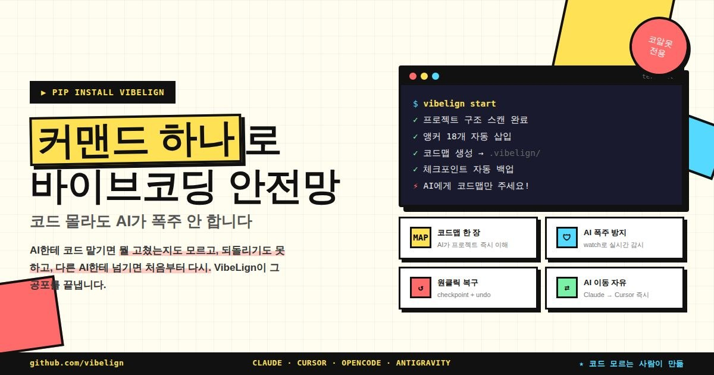

<p align="center">
  
</p>

<p align="center">
  <b>🇰🇷 한국어</b> &nbsp;|&nbsp; <a href="README.md">🇺🇸 English</a>
</p>

<p align="center">
  <a href="https://pypi.org/project/vibelign/"></a>
  
  
  
</p>

---

# 🎮 VibeLign — AI 코딩의 안전장치

> ### 이런 적 있나요?
>
> - AI한테 간단한 기능을 추가해달라고 했더니 **파일 전체를 다시 썼어요**
> - 모든 코드가 `main.py` 한 파일에 들어있어요 — **1000줄 넘음, 관리 불가능**
> - AI가 다른 파일을 건드려서 이제 아무것도 안 돼요
> - 되돌리려고 하는데 방법을 몰라요
>
> **이거를 위해 만들었어요!**

```bash
pip install vibelign
vib start
```



---

## 🤔 VibeLign이 뭔가요?

AI 코딩 도구(Claude Code, Cursor 등)는 코드를 빨리 작성해요. 하지만 **문제**가 있어요:

| 문제 | VibeLign이 해결해줌 |
|------|---------------------|
| 모든 코드가 `main.py`에 들어감 | AI가 **알아서 정리**하게 함 |
| AI가 요청한 것과 다른 걸 함 | **정확한 수정 요청**을 만들어줌 |
| 코드가 망가졌는데 되돌릴 수 없음 | **세이브 & 되돌리기** 기능 제공 |

**어떤 AI 도구와도 함께 쓸 수 있어요**: Claude Code · Cursor · Codex · OpenCode

---

## 📝 딱 3가지만 기억하세요

```
AI가 코딩하기 전  →  vib checkpoint "작업 전"     # 세이브
AI가 망쳤어       →  vib undo                      # 되돌리기
괜찮아졌어        →  vib checkpoint "완료"          # 다시 세이브
```

> Git 몰라도 돼요. 그냥 `vib`만 치면 돼요.

---

## 🚀 3단계로 시작하기

```bash
# 1. 설치
pip install vibelign

# 2. 프로젝트 폴더로 이동
cd my-project

# 3. 시작!
vib start
```

---

## 📚 모든 명령어

### 기본 (꼭 알아두기)

| 명령어 | 하는 일 |
|--------|---------|
| `vib start` | 처음 한 번만! 프로젝트 세팅 |
| `vib checkpoint "메시지"` | 지금 상태 저장 (게임 세이브처럼) |
| `vib checkpoint` | 저장할 때 메시지 입력하라고 뜸 |
| `vib undo` | 마지막 세이브 지점으로 돌아감 |
| `vib history` | 세이브 목록 보기 |

### AI한테 코딩 요청할 때

| 명령어 | 하는 일 |
|--------|---------|
| `vib patch "버튼 추가해줘"` | AI에게 어떻게 수정할지 알려줌 (한국어 OK!) |
| `vib anchor` | AI가 수정해도 되는 곳을 표시해줌 |
| `vib scan` | 파일 정리 + 최신 상태 확인 |

### 확인하고 검증할 때

| 명령어 | 하는 일 |
|--------|---------|
| `vib doctor` | 프로젝트 건강 상태 확인 |
| `vib explain` | 뭐가 바뀌었는지 쉬운 말로 설명 |
| `vib guard` | 코드가 망가지지 않았는지 확인 |
| `vib ask 파일명.py` | 파일이 뭘 하는지 설명해달라고 함 |

### 파일 보호

| 명령어 | 하는 일 |
|--------|---------|
| `vib protect 파일명.py` | 중요한 파일 잠금 (AI가 못 건드림) |
| `vib protect --list` | 잠근 파일 목록 보기 |
| `vib protect --remove 파일명.py` | 잠금 해제 |

### 설정 & 내보내기

| 명령어 | 하는 일 |
|--------|---------|
| `vib config` | API 키 설정 |
| `vib export claude` | Claude Code용 설정 파일 만들기 |
| `vib export cursor` | Cursor용 설정 파일 만들기 |
| `vib export opencode` | OpenCode용 설정 파일 만들기 |

### 기타 유용한 것들

| 명령어 | 하는 일 |
|--------|---------|
| `vib watch` | 파일 변경 실시간 감시 |
| `vib bench` | 앵커가 얼마나 효과적인지 테스트 |
| `vib manual` | 상세 사용 설명서 보기 |
| `vib rules` | AI 개발 규칙 전체 보기 |
| `vib transfer` | AI 도구 바꿀 때 프로젝트 정보引き継ぐ |
| `vib completion` | 탭 누르면 자동완성되게 설정 |
| `vib install` | 설치 방법을 단계별로 알려줌 |

---

## 💡 추천하는 흐름

```bash
# 처음 시작할 때
vib start

# AI가 코딩하기 전
vib checkpoint "로그인 기능 추가 전"
vib doctor --strict
vib patch "로그인 버튼 만들어줘"

# AI가 코딩한 후
vib explain --write-report
vib guard --strict --write-report

# 다 됐으면
vib checkpoint "로그인 기능 완성!"

# 실수했으면
vib undo
```

---

## 🔧 설치 방법

### 방법 1: uv (추천, 빠름)
```bash
uv tool install vibelign
```

### 방법 2: pip
```bash
pip install vibelign
```

설치하면 `vib`랑 `vibelign` 둘 다 쓸 수 있어요.

---

## 📖 더 자세히 알고 싶으면

```bash
vib manual          # 상세 사용 설명서
vib manual rules    # AI 개발 규칙만 보기
vib rules           # rules랑 같음
```

---

## 🎯 우리 약속

> *"AI 코딩은 빠르다. 하지만 안전장치 없으면 만든 걸 다 날릴 수 있다."*

VibeLign이 보장하는 것:
- ✅ 1초 만에 세이브 (`vib checkpoint "설명"`)
- ✅ 1초 만에 되돌리기 (`vib undo`)
- ✅ Git 몰라도 됨
- ✅ 초보자도 쉽게 쓸 수 있음

---

⭐ **VibeLign이 코드 저장해줬으면 Star 하나 부탁해요 — 감사합니다!**

---

## 📋 업데이트 내역 (Release Notes)

**v1.6.0** — MCP 서버 + AI 개발 규칙 시스템:

- `vib mcp` — MCP(Model Context Protocol) 서버 실행 (Claude Desktop 연동)
- `vib rules` — AI 개발 규칙 전체를 CLI에서 바로 확인
- `vib manual rules` — 개발 규칙 상세 매뉴얼
- Anchor intent system — 앵커에 의도(intent) 정보 저장
- 한국어 토크나이저 — patch 요청을 한국어로도 정확하게 해석
- AI_DEV_SYSTEM — 유지보수성/함수 디자인 규칙 추가 (Section 6-1, 14)
- `vib scan` 버그 수정 — set_intent 속성 누락 해결

**v1.5.32** — 체크포인트/되돌리기 UX 개편 + AI 설정 파일 보호:

- `vib checkpoint` — 메시지 입력 프롬프트 지원
- `vib undo` — 번호 선택 + 취소 옵션 `[0]`
- `vib history` — 초 단위 타임스탬프 표시
- `vib start` — 초보자 온보딩 + 첫 체크포인트 자동 저장
- `vib export` — AGENTS.md, CLAUDE.md, OPENCODE.md, .cursorrules 보호

**v1.5.0** — 멀티 AI 툴 설정 내보내기:

- `vib export claude` — Claude Code용 CLAUDE.md 생성
- `vib export cursor` — Cursor용 .cursorrules 생성
- `vib export opencode` — OpenCode용 OPENCODE.md 생성
- `vib export antigravity` — Codex/에이전트용 AGENTS.md 생성
- 내보낸 파일에 VibeLign 마커 추가 (덮어쓰기 방지)

**v1.1.0** — 코알못을 위한 핵심 기능 추가:

- `vib init` — VibeLign 초기화/리셋
- `vib start` — 처음 사용자 가이드
- `vib checkpoint` / `vib undo` — Git 없이 세이브 & 되돌리기
- `vib protect` — 중요 파일 잠금
- `vib ask` — 파일 설명 AI 프롬프트 생성
- `vib history` — 체크포인트 이력 보기

---

# 라이선스

MIT
