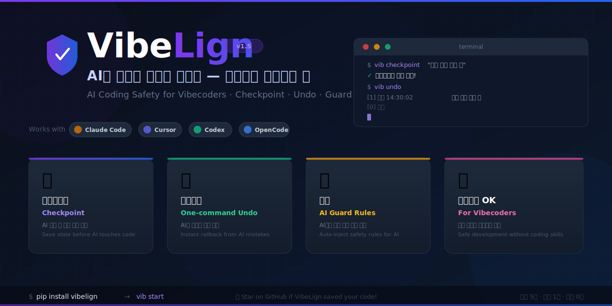

<p align="center">
  
</p>

<p align="center">
  <b>🇰🇷 한국어</b> &nbsp;|&nbsp; <a href="README.md">🇺🇸 English</a>
</p>

<p align="center">
  <a href="https://pypi.org/project/vibelign/"></a>
  
  
  
</p>

---

# VibeLign

> ### 이런 경험, 있으신가요?
>
> - 버튼 하나만 추가해달랬는데 AI가 **파일 전체를 갈아엎어버렸다**
> - 기능을 추가할 때마다 **`main.py` 한 파일에 코드가 계속 쌓인다**
> - 내가 요청한 것과 **전혀 다른 방향으로 수정**해놓고 모른 척한다
> - 되돌리고 싶은데 **git은 모르고, Ctrl+Z는 이미 한계**다
>
> **VibeLign은 바로 그 문제들을 해결하기 위해 만들어졌습니다.**

```bash
pip install vibelign
vib start
```

---

# VibeLign이 해결하는 3가지 문제

AI 코딩 도구는 빠르지만, 초보자 프로젝트에서 항상 같은 문제를 일으킵니다:

| 문제 | VibeLign의 해결 |
|------|----------------|
| 🏚️ 모든 코드가 `main.py` 한 파일에 몰림 | **구조 규칙 주입** — AI가 코드를 올바르게 분리하도록 강제 |
| 🤖 내 말대로 안 고치고 멋대로 수정 | **정밀 패치 요청서 생성** — AI가 정확히 이해하는 명령서 작성 |
| 💥 잘못 수정된 코드를 되돌릴 방법이 없음 | **체크포인트 + 되돌리기** — 몇 초 만에 이전 상태로 복구 |

지원 도구: **Claude Code · Cursor · Codex · OpenCode · 모든 AI 코딩 에이전트**

---

# 딱 3가지만 기억하세요

```
작업 전       →   vib checkpoint "설명"    # 세이브 포인트 저장
AI가 망쳤으면 →   vib undo                 # 즉시 복구
잘 됐으면     →   vib checkpoint "완료"   # 또 저장
```

> Git 몰라도 됩니다. 터미널 겁나도 됩니다. **그냥 vib만 기억하세요.**

---

# 퀵 스타트

```bash
# 1. 설치
pip install vibelign

# 2. 프로젝트 폴더로 이동
cd 내-프로젝트

# 3. 시작
vib start
```

---

# 왜 바이브코딩 초보에게 VibeLign이 필요할까요?

AI 코딩 도구를 쓰면 빠르게 뭔가 만들 수 있어요. 하지만 코드를 모르는 초보일수록 이런 상황이 반복됩니다:

- 한 가지만 고쳐달랬는데 **만지지 말라고 한 파일까지 수정**해놓는다
- 새 기능을 추가할 때마다 **`main.py` 하나에 죄다 몰아넣는다**
- 로그인 기능 만들어달랬는데 **결제 코드까지 건드려놨다**
- 어제까지 잘 되던 게 갑자기 안 되는데 **뭐가 바뀐지 모른다**

VibeLign은 AI가 **선을 지키게** 만들고, 잘못됐을 때 **즉시 되돌릴 수 있게** 해줍니다.

---

# AI 코딩 작업 순서

```
vib init → checkpoint → patch → AI 수정 → explain → guard → checkpoint (또는 undo)
```

| 명령어 | 하는 일 |
|--------|---------|
| `vib init` | VibeLign 메타데이터를 초기화/재설치해요 |
| `vib start` | 신규 사용자 온보딩 — "딱 3가지 규칙" 안내 + 첫 체크포인트 저장 |
| `vib checkpoint` | 현재 상태를 세이브 포인트로 저장 — 메시지 없으면 자동으로 입력 안내 |
| `vib undo` | 인터랙티브 되돌리기 — 번호 목록에서 선택, `[0]`으로 취소 가능 |
| `vib history` | 초 단위 시간으로 저장된 체크포인트 목록 확인 (`오늘 14:30:02`) |
| `vib protect` | 중요한 파일을 AI가 못 건드리게 잠가요 |
| `vib ask` | 파일을 쉬운 말로 설명해 달라는 프롬프트를 만들어요 |
| `vib doctor` | 프로젝트 구조가 괜찮은지 분석해요 |
| `vib anchor` | 안전하게 고칠 수 있는 구역(앵커)을 정해요 |
| `vib scan` | anchor + 프로젝트 맵 새로고침을 한 번에 |
| `vib patch` | AI에게 보낼 안전한 수정 요청서를 만들어요 |
| `vib explain` | 최근에 바뀐 내용을 알기 쉽게 설명해줘요 |
| `vib guard` | 프로젝트가 여전히 안전한지 검사해요 |
| `vib export` | AI 도구별 설정 파일 생성 (claude / cursor / opencode / antigravity) |
| `vib watch` | 실시간으로 파일 변화를 감시해요 |

---

# 핵심 명령어

```bash
# --- 프로젝트 세팅 ---
vib init
vib start                                 # 처음 쓰는 사람용 가이드 온보딩

# --- 저장 & 되돌리기 ---
vib checkpoint "로그인 기능 추가 전"     # 메시지와 함께 저장
vib checkpoint                            # 메시지 없으면 입력 안내
vib undo                                  # 목록에서 선택해서 복구
vib history                               # 저장된 체크포인트 전체 보기

# --- 파일 보호 ---
vib protect main.py
vib protect --list
vib protect --remove main.py

# --- 파일 설명 요청 ---
vib ask login.py
vib ask login.py --write

# --- AI 코딩 작업 ---
vib doctor
vib anchor
vib scan
vib patch "진행 표시바 추가해줘"
vib explain
vib guard

# --- AI 설정 파일 내보내기 ---
vib export claude       # Claude Code용 CLAUDE.md
vib export cursor       # Cursor용 .cursorrules
vib export opencode     # OpenCode용 OPENCODE.md
vib export antigravity  # Codex/에이전트용 AGENTS.md

# --- 감시 ---
vib watch
```

---

# 설치 방법

### 추천 방법 (uv)
```bash
uv tool install vibelign
```

### 다른 방법 (pip)
```bash
pip install vibelign
```

설치 후 `vib`과 `vibelign` 두 명령어 모두 사용 가능합니다.

---

# 권장 사용법

```bash
vib init
vib checkpoint "프로젝트 시작"

# AI 작업 전
vib doctor --strict
vib anchor
vib patch "원하는 변경사항"

# AI 작업 후
vib explain --write-report
vib guard --strict --write-report

# 이상 없으면 저장
vib checkpoint "완료: 작업 내용"

# 이상 있으면 되돌리기
vib undo
```

---

# 출시 상태

**v1.5.32** — 체크포인트/되돌리기 UX 개편 + AI 설정 파일 보호:

- `vib checkpoint` — 메시지 없이 실행하면 자동으로 메시지 입력 안내 (git commit 방식)
- `vib undo` — 완전 인터랙티브: 번호 목록 + 친숙한 시간 표시 + `[0] 취소` 옵션
- `vib history` — 초 단위 시간 표시 (`오늘 14:30:02`)로 같은 분의 체크포인트도 구별 가능
- `vib start` — 신규 사용자 온보딩에 "딱 3가지만 기억하세요" 추가 + 첫 체크포인트 바로 저장
- `vib export` — `AGENTS.md`, `CLAUDE.md`, `OPENCODE.md`, `.cursorrules` 마커 보호 (덮어쓰기 방지)
- GitHub 배너 이미지 추가

**v1.5.0** — 멀티 AI 툴 설정 내보내기:

- `vib export claude` — Claude Code용 `CLAUDE.md` 안전 규칙 생성
- `vib export cursor` — Cursor용 `.cursorrules` 생성
- `vib export opencode` — OpenCode용 `OPENCODE.md` 생성
- `vib export antigravity` — Codex/에이전트용 `AGENTS.md` 생성
- 모든 내보낸 파일에 VibeLign 마커 적용 (사용자 커스텀 내용 보호)

**v1.1.0** — 코알못을 위한 핵심 기능 추가:

- `init` — VibeLign 메타데이터 초기화/재설치
- `start` — 처음 쓰는 사람용 가이드 온보딩
- `checkpoint` / `undo` — git 몰라도 되는 세이브/복구
- `protect` — 중요 파일 AI로부터 보호
- `ask` — 코드 쉬운 말로 설명받기
- `history` — 체크포인트 이력 보기

---

# VibeLign의 철학

AI 코딩은 정말 빠릅니다. 하지만 안전장치 없이 달리다 보면 언제 터질지 모릅니다.

VibeLign은 **코알못 바이브코더도 두려움 없이 AI 코딩을 즐길 수 있도록** 만들어진 안전망입니다.

저장은 1초. 복구는 1초. 배울 건 없음.

---

⭐ **VibeLign이 당신의 코드를 구해줬다면, Star 한 번 눌러주세요. 개발에 큰 힘이 됩니다!**

---

# 라이선스

MIT
