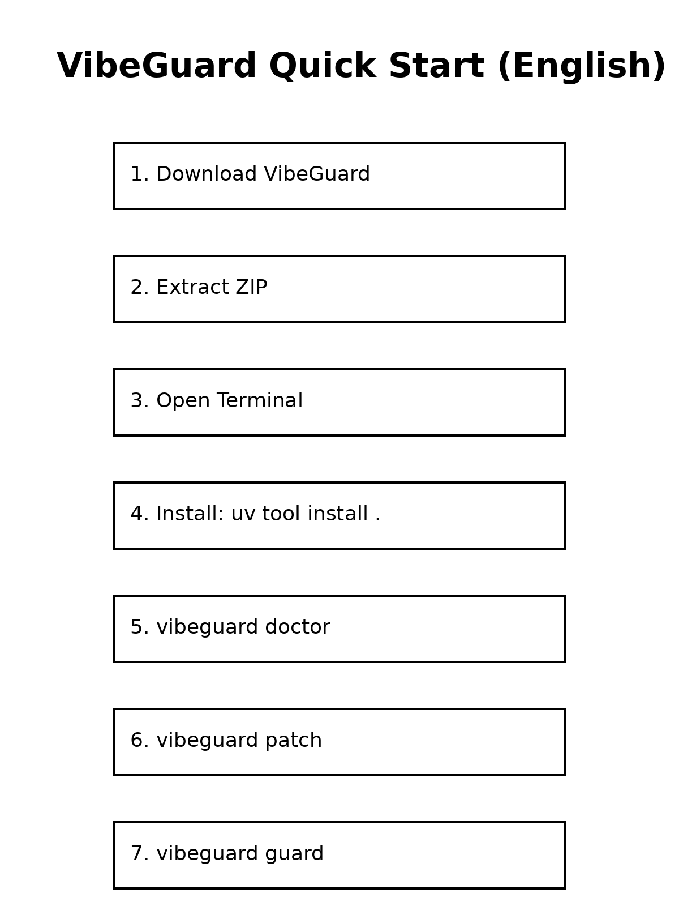
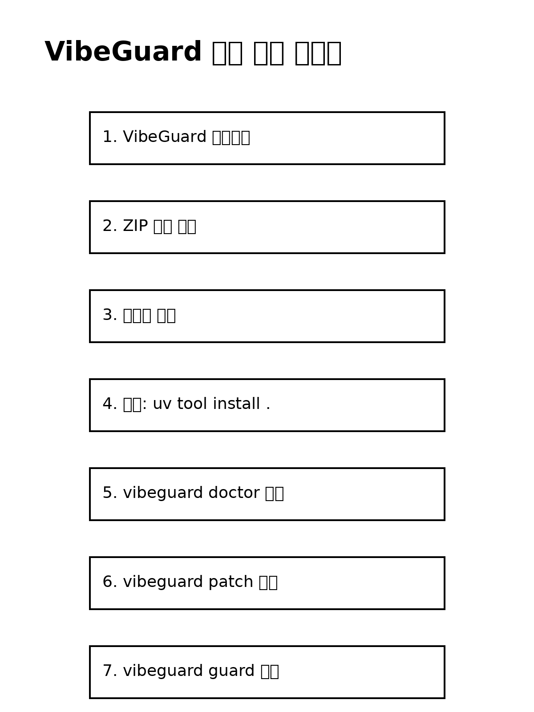

# VibeGuard

**AI coding safety system for vibecoders.**

AI writes code fast.
VibeGuard keeps your project safe.

---

# Quick Start



---

# Why VibeGuard?

AI coding is powerful, but it often creates structural problems:

- giant `main.py`
- random `utils.py` catch-all files
- whole-file rewrites
- mixed UI + business logic
- uncontrolled wide patches
- no way to undo AI changes

These problems are common when using:

- Claude Code
- Cursor
- OpenCode
- GPT coding workflows
- AI coding agents

VibeGuard adds **guardrails** so AI edits remain safe — and gives you a simple save/restore system so you can always go back.

---


# Architecture & Design Documents

The full design documents for VibeLign are located in:

Recommended reading order:

1. VibeLign_Ultimate_Vision.md
2. VibeLign_System_Architecture.md
3. VibeLign_CLI_Strategy.md
4. VibeLign_vib_doctor_Final_Design_Spec.md

These documents describe the internal architecture and future roadmap of the project.

---

# AI Coding Workflow

Recommended loop:

```
init → checkpoint → patch → AI edit → explain → guard → checkpoint (or undo)
```

| Command | Purpose |
|---------|---------|
| `init` | one-command project setup |
| `checkpoint` | save current state (like a game save point) |
| `undo` | restore to last checkpoint |
| `protect` | lock important files from AI edits |
| `ask` | generate a plain-language explanation prompt |
| `history` | view all saved checkpoints |
| `doctor` | analyze project structure |
| `anchor` | insert safe edit anchors |
| `patch` | generate safe AI patch request |
| `explain` | explain recent changes |
| `guard` | verify project safety |
| `export` | export tool-specific helper files |
| `watch` | real-time monitoring |

---

# Core Commands

```bash
# --- Project setup ---
vibeguard init
vibeguard init --tool claude

# --- Save & restore ---
vibeguard checkpoint "before login feature"
vibeguard undo
vibeguard history

# --- File protection ---
vibeguard protect main.py
vibeguard protect --list
vibeguard protect --remove main.py

# --- Ask AI to explain a file ---
vibeguard ask login.py
vibeguard ask login.py --write
GEMINI_MODEL=gemini-2.5-flash-lite vibeguard ask login.py

# --- API config ---
vibeguard config

# --- AI coding workflow ---
vibeguard doctor
vibeguard anchor
vibeguard patch "add progress bar"
vibeguard explain
vibeguard guard

# --- Export & monitor ---
vibeguard export claude
vibeguard export opencode
vibeguard export cursor
vibeguard export antigravity
vibeguard watch
```

---

# Install

## Recommended (uv)

```
uv tool install .
```

## Alternative (pip)

```
pip install -e .
```

---

# First Test

Run these commands:

```bash
vibeguard init
vibeguard checkpoint "first save"
vibeguard doctor
vibeguard anchor --dry-run
vibeguard patch "add progress bar" --json
vibeguard explain --json
vibeguard guard --json
```

If these commands work, VibeGuard is installed correctly.

---

# Visual Guide (Korean)



---

# Watch Mode (Optional)

Real-time project monitoring.

Install dependency:

```
uv add watchdog
```

or

```
pip install watchdog
```

Run:

```
vibeguard watch
```

---

# Recommended Workflow

```bash
vibeguard init
vibeguard checkpoint "project start"

# --- before AI edit ---
vibeguard doctor --strict
vibeguard anchor
vibeguard patch "your request here"

# --- after AI edit ---
vibeguard explain --write-report
vibeguard guard --strict --write-report

# --- if OK ---
vibeguard checkpoint "done: your task"

# --- if NOT OK ---
vibeguard undo
```

---

# Documentation

Beginner guide:

```
VibeGuard_QUICKSTART.md
```

Full documentation:

```
docs/MANUAL.md
```

---

# Release Status

**v1.1.0** — New beginner-friendly commands added:

- `init` — one-command project setup
- `checkpoint` / `undo` — save and restore without Git knowledge
- `protect` — lock files from AI edits
- `ask` — generate plain-language explanation prompts
- `history` — view all checkpoints

Previous improvements:

- fixed CLI import behavior
- safer patch suggestions
- improved fallback explain/guard logic
- better path handling

---

# Philosophy

AI coding is fast.

But without guardrails, it can break project structure.

VibeGuard adds **structure-aware safety** to AI-driven development — and makes save/restore simple enough for anyone.

---

# License

MIT

---

# VibeGuard (한글 번역)

**AI 코딩 안전 시스템: 바이브코더를 위한 보호막**

AI는 코드를 정말 빨리 작성하지만, 가끔 프로젝트를 엉망으로 만들기도 합니다.
VibeGuard는 여러분의 소중한 프로젝트를 안전하게 지켜줍니다.

---

## 퀵 스타트 (빨리 시작하기)


---

## 왜 VibeGuard가 필요한가요?

AI로 코딩을 하면 힘은 세지지만, 가끔 규칙 없는 코드가 생겨서 문제가 됩니다:

- `main.py` 파일 하나에 모든 코드가 다 들어가서 너무 커질 때
- 아무 코드나 다 모아둔 정체불명의 `utils.py` 파일이 생길 때
- AI가 마음대로 파일 전체를 싹 다 새로 써버릴 때
- 화면 디자인(UI)과 실제 기능(로직)이 마구 뒤섞일 때
- AI가 바꾼 코드를 되돌릴 방법이 없을 때

Claude Code, Cursor, OpenCode 같은 AI 도구를 쓸 때 이런 일이 자주 생깁니다. VibeGuard는 AI가 안전하게 코드를 고칠 수 있도록 **가이드라인(안전 난간)**을 쳐주고, 언제든 이전 상태로 되돌아갈 수 있는 **세이브 포인트** 기능을 제공합니다.

---

## AI 코딩 작업 순서

VibeGuard가 추천하는 안전한 개발 순서:

```
init → checkpoint → patch → AI 수정 → explain → guard → checkpoint (또는 undo)
```

| 명령어 | 하는 일 |
|--------|---------|
| `init` | 프로젝트를 한 번에 세팅해요 |
| `checkpoint` | 현재 상태를 세이브 포인트로 저장해요 |
| `undo` | 마지막 세이브 포인트로 되돌아가요 |
| `protect` | 중요한 파일을 AI가 못 건드리게 잠가요 |
| `ask` | 파일을 쉬운 말로 설명해 달라는 프롬프트를 만들어요 |
| `history` | 저장된 체크포인트 목록을 보여줘요 |
| `doctor` | 프로젝트 구조가 괜찮은지 분석해요 |
| `anchor` | 안전하게 고칠 수 있는 구역(앵커)을 정해요 |
| `patch` | AI에게 보낼 안전한 수정 요청서를 만들어요 |
| `explain` | 최근에 바뀐 내용을 알기 쉽게 설명해줘요 |
| `guard` | 프로젝트가 여전히 안전한지 검사해요 |
| `export` | 도구별 템플릿 파일을 내보내요 |
| `watch` | 실시간으로 파일 변화를 감시해요 |

---

## 핵심 명령어

```bash
# --- 프로젝트 세팅 ---
vibeguard init
vibeguard init --tool claude

# --- 저장 & 되돌리기 ---
vibeguard checkpoint "로그인 기능 추가 전"
vibeguard undo
vibeguard history

# --- 파일 보호 ---
vibeguard protect main.py
vibeguard protect --list
vibeguard protect --remove main.py

# --- 파일 설명 요청 ---
vibeguard ask login.py
vibeguard ask login.py --write

# --- AI 코딩 작업 ---
vibeguard doctor
vibeguard anchor
vibeguard patch "진행 표시바 추가해줘"
vibeguard explain
vibeguard guard

# --- 내보내기 & 감시 ---
vibeguard export claude
vibeguard export opencode
vibeguard export cursor
vibeguard export antigravity
vibeguard watch
```

---

## 설치 방법

### 추천 방법 (uv 사용)
```bash
uv tool install .
```

### 다른 방법 (pip 사용)
```bash
pip install -e .
```

---

## 첫 번째 테스트

제대로 설치됐는지 터미널에 입력해 보세요:

```bash
vibeguard init
vibeguard checkpoint "첫 번째 저장"
vibeguard doctor
vibeguard anchor --dry-run
vibeguard patch "진행 표시바 추가" --json
vibeguard explain --json
vibeguard guard --json
```

이 명령어들이 잘 작동한다면 준비 끝!

---

## 시각 가이드


---

## 실시간 감시 모드 (선택 사항)

파일이 바뀔 때마다 실시간으로 지켜보게 할 수 있습니다.

1. 먼저 도구 설치: `uv add watchdog` (또는 `pip install watchdog`)
2. 실행: `vibeguard watch`

---

## 권장 사용법

```bash
vibeguard init
vibeguard checkpoint "프로젝트 시작"

# AI 작업 전
vibeguard doctor --strict
vibeguard anchor
vibeguard patch "원하는 변경사항"

# AI 작업 후
vibeguard explain --write-report
vibeguard guard --strict --write-report

# 이상 없으면 저장
vibeguard checkpoint "완료: 작업 내용"

# 이상 있으면 되돌리기
vibeguard undo
```

---

## 도움말

- 초보자 가이드: `VibeGuard_QUICKSTART.md`
- 상세 설명서: `docs/MANUAL.md`

---

## 출시 상태

**v1.1.0** — 코알못을 위한 핵심 기능 추가:

- `init` — 프로젝트 한 번에 세팅
- `checkpoint` / `undo` — git 몰라도 되는 세이브/복구
- `protect` — 중요 파일 AI로부터 보호
- `ask` — 코드 쉬운 말로 설명받기
- `history` — 체크포인트 이력 보기

이전 개선 사항:

- 명령어 실행 방식 개선
- 더 안전한 수정 제안
- 설명과 감시 기능 향상
- 경로 처리 개선

---

## VibeGuard의 철학

AI 코딩은 정말 빠릅니다. 하지만 안전장치가 없으면 프로젝트의 구조가 무너질 수 있죠.
VibeGuard는 AI 개발에 **구조를 생각하는 안전함**을 더해줍니다 — 그리고 누구나 쉽게 저장하고 되돌릴 수 있게 해줍니다.

---

## 라이선스

MIT
