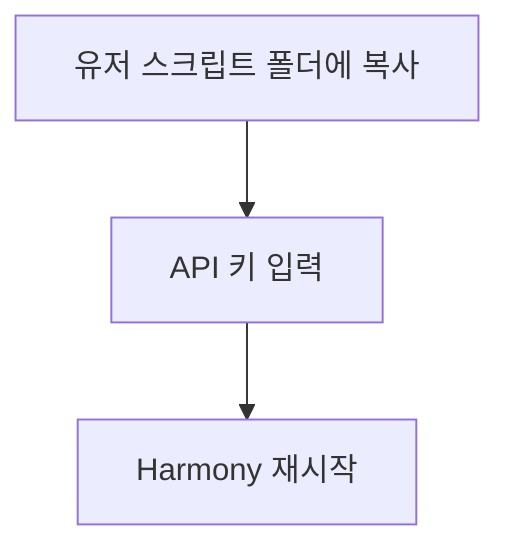
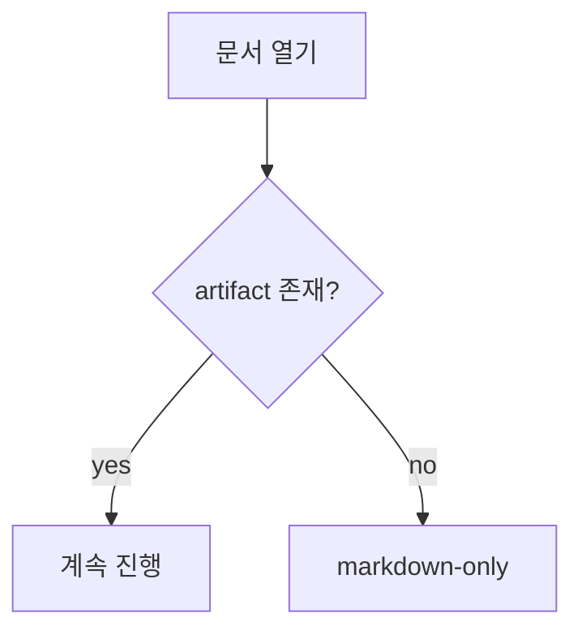
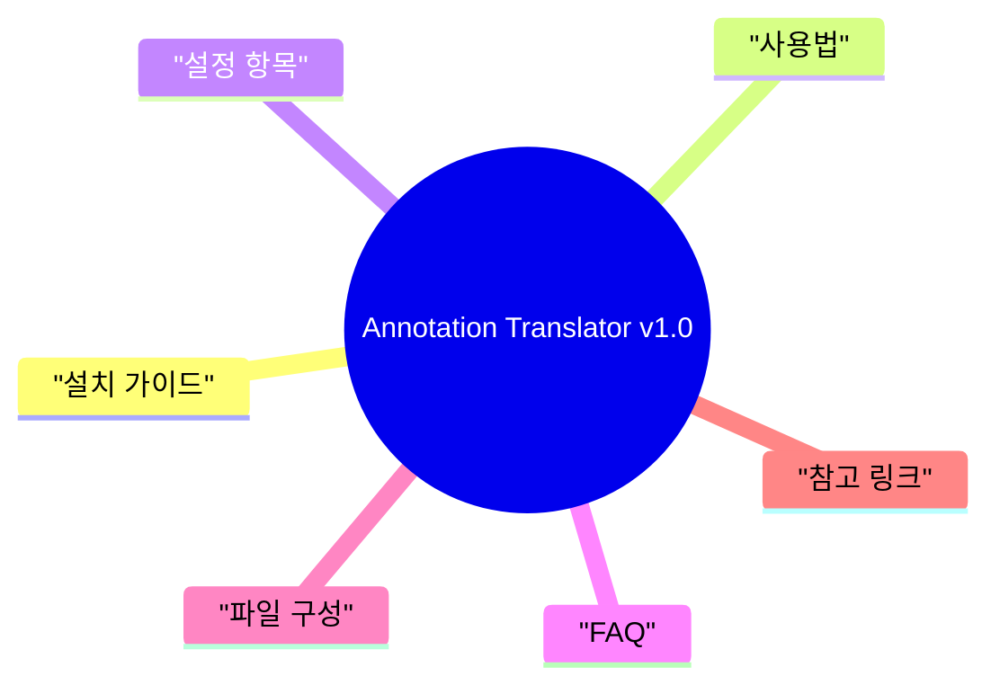
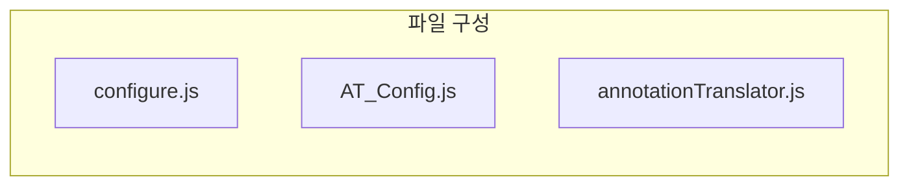
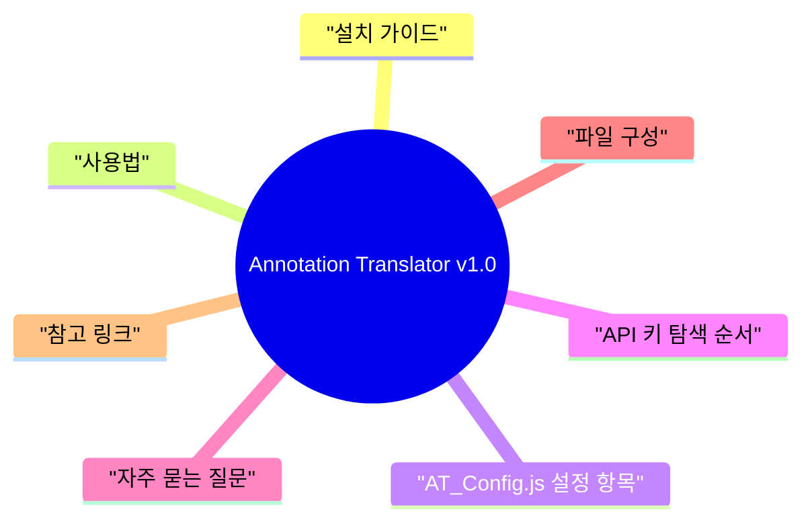

# Heuristic Mermaid 자동 생성 설계

> **Status:** implemented in repository. Current code reflects the v1 scope described here.

## 문제

현재 Docs Viewer는 markdown 안에 직접 작성된 ` ```mermaid ` 블록만 추출한다.

- `vibelign/core/docs_visualizer.py`는 extraction-only 구조다.
- README / guide / spec / plan 문서처럼 구조는 풍부하지만 Mermaid가 없는 문서는 `diagram_blocks=[]`가 된다.
- 사용자는 “문서를 읽으면 구조 다이어그램이 자동으로 나오길” 기대하지만, 현재 계약은 그 기대를 충족하지 못한다.

## 목표

문서에 authored Mermaid가 없어도 markdown 구조를 바탕으로 **신뢰 가능한 범위에서만** Mermaid 다이어그램을 자동 생성한다.

핵심 원칙:

- markdown가 source of truth다.
- authored Mermaid가 있으면 그것을 항상 우선한다.
- heuristic은 deterministic해야 한다.
- confidence가 낮으면 생성하지 않는다.
- autogenerated diagram은 authored처럼 보이면 안 된다.

## 핵심 변경

### 1. diagram provenance 확장

`diagram_blocks`에 출처와 신뢰 메타를 추가한다.

```json
{
  "id": "diagram-heuristic-1",
  "kind": "mermaid",
  "title": "설치 흐름",
  "source": "flowchart TD\nA[설치] --> B[설정]",
  "provenance": "heuristic",
  "generator": "step-flow-v1",
  "confidence": "high",
  "warnings": []
}
```

- `provenance`: `authored | heuristic | ai_draft`
- `generator`: 생성 규칙 이름
- `confidence`: persisted diagram에서는 `high | medium`만 사용
- `warnings`: diagram 자체에 붙는 local warning 메모

> `score < 4`처럼 diagram이 아예 생성되지 않는 경우의 warning은 `diagram_blocks[].warnings`가 아니라 artifact root `warnings`에 기록한다.

### 2. authored-first + heuristic fallback

현재:

```python
diagram_blocks = _extract_mermaid_blocks(normalized, sections)
```

제안:

```python
diagram_blocks = _extract_mermaid_blocks(normalized, sections)
if not _has_usable_authored_diagram(diagram_blocks):
    diagram_blocks = _generate_heuristic_diagrams(
        lines=lines,
        title=title,
        summary=summary,
        sections=sections,
        action_items=action_items,
        warnings=warnings,
    )
```

> `_has_usable_authored_diagram()` 은 단순히 `len(blocks) > 0` 을 보지 않는다.
> 아래 조건을 모두 만족하는 authored block이 **1개 이상** 존재해야 authored로 인정한다:
>
> - `source` 가 공백만이 아닌 non-empty 문자열
> - Mermaid 선두 keyword(`flowchart`, `graph`, `mindmap`, `sequenceDiagram`, `classDiagram`, `stateDiagram`, `erDiagram`, `journey`, `pie`, `gantt`, `gitGraph`, `timeline`) 중 하나로 시작
>
> 위 조건을 만족하는 authored block이 없으면 heuristic fallback이 실행되며, 빈 authored block은 `auto_diagram_note: empty authored mermaid block ignored` warning 과 함께 drop한다.
> 초기 계약에서 authored block의 invalid 판단은 **빈 source 또는 선두 keyword 미매칭**을 의미한다.
> 즉, 여기서 말하는 invalid authored block은 Mermaid 엔진의 전체 parse validation을 뜻하지 않는다. v1에서는 cheap gate만 적용한다.

### 2.1 cross-platform inheritance

이 설계는 기존 docs viewer의 cross-platform 규칙을 그대로 상속한다.

- path separator / relative path key / `source_hash` 정책을 새로 정의하지 않는다.
- heuristic generator는 기존 visualizer가 이미 정규화한 markdown 텍스트만 입력으로 사용한다.
- 즉 BOM strip, newline normalize, UTF-8 정책은 기존 helper가 authoritative하다.
- heuristic logic은 raw bytes, OS-native line ending, OS-native path separator를 직접 해석하지 않는다.

이 기능은 새 platform layer가 아니라, 기존 hash-bound derived artifact 파이프라인 위에 얹는 parser/rendering 확장이다.

### 3. heuristic generator는 4종을 지원 (단, 초기 릴리즈는 3종)

스펙은 아래 4종을 정의한다.

1. `step_flow`
2. `decision_flow`
3. `heading_mindmap`
4. `component_flow`

**초기 릴리즈 범위:** `step_flow`, `heading_mindmap`, `component_flow` 3종만 구현한다.
`decision_flow`는 자유 서술체 마크다운에서 `{question?}` / `yes-branch` / `no-branch` 노드를
deterministic하게 추출하는 알고리즘이 본 스펙에서 아직 확정되지 않았으므로 **후속 릴리즈로 유예**한다.
score guide와 tie-break 순서에는 계속 존재하되, candidate 생성기가 `None`을 반환하도록 구현하여
선택되더라도 바로 다음 후보로 fallback한다.

> 즉 v1에서는 decision signal이 탐지되고 `decision_flow`가 선택 단계까지 올라갈 수는 있어도,
> 실제 emitted diagram은 항상 **다음 fallback 후보의 결과**이거나 최종적으로 no-diagram이다.

애매한 문서는 생성하지 않는다.

## signal 추출 규칙

### ordered step

다음 패턴을 순서형 step으로 본다.

- `1. foo`
- `2) foo`
- `① foo`
- `Step 1: foo`
- `1단계 — foo`

```python
ORDERED_STEP_RE = re.compile(
    r"^\s*(?:\d+[.)]|[①②③④⑤⑥⑦⑧⑨⑩]|step\s*\d+[:.)]?|\d+단계)\s*(?:[-—:]\s*)?(?P<text>.+)$",
    re.IGNORECASE,
)
```

> **주의:** markdown ordered list (`1. foo`, `2. bar`)는 changelog / TOC / nested list 에서도 흔하게 나온다.
> 따라서 정규식 매칭만으로 step으로 판정하지 않고, **연속 증가 번호 3개 이상**(`1,2,3…`)을 요구한다.
> 번호가 리셋되거나 건너뛰면 step sequence로 보지 않는다.
>
> "연속"의 정의는 다음과 같다:
>
> - 동일 list block scope 내에서만 연속성을 판단한다. (빈 줄 2개 이상 / 다른 heading / fenced code block / 다른 block element 가 나타나면 list scope 가 끊긴 것으로 본다.)
> - scope 내에서 `n, n+1, n+2, …` 형태로 **1씩 증가**해야 한다 (markdown renderer가 auto-renumber 하더라도 source 번호 기준).
> - nested list (indent 가 상위와 다른 항목) 는 최상위 sequence로 카운트하지 않는다.
> - `Step N` / `N단계` / `①②③` 표기도 마찬가지로 같은 block 범위 내에서 1씩 증가해야 한다.
> - cross-section / cross-heading step은 인정하지 않는다 (heading 사이에 끼어있으면 끊긴 것).

### action_items / checklist

`- [ ] foo`, `- [x] foo` 패턴을 checklist로 본다.

```python
CHECKLIST_RE = re.compile(r"^\s*[-*]\s*\[[ xX]\]\s+(?P<text>.+)$")
```

`action_items`는 이 helper가 `signal` dataclass에 채운다.
별도 저장소나 외부 파이프라인에 의존하지 않는다.

### decision line

다음 표현을 decision 신호로 본다.

- `if`, `when`, `fallback`, `yes`, `no`
- `존재?`, `일치?`, `없으면`, `실패 시`, `성공 시`

```python
DECISION_HINT_RE = re.compile(
    r"\b(if|when|else|fallback|exists?|missing|match|mismatch|yes|no|success|fail)\b|존재\?|일치\?|없으면|실패\s*시|성공\s*시",
    re.IGNORECASE,
)
```

### file / component signal

다음 패턴을 component 후보로 본다.

- `` `configure.js` ``
- `README.md`
- `foo.py`

```python
# forward-slash, backslash, drive-letter 를 모두 허용한다.
FILE_LIKE_RE = re.compile(
    r"(?:[A-Za-z]:[\\/])?"              # optional drive letter (Windows)
    r"(?:[\w.\-]+[\\/])*"               # path segments with / or \
    r"[\w.\-]+\.(?:js|ts|tsx|py|md|json|yaml|yml|rs)\b"
)
```

> 위 regex는 `configure.js`, `docs/guide/README.md`, `docs\guide\README.md`, `C:\foo\bar.py` 를 모두 매칭한다.
> path-like text는 component 후보를 찾기 위한 display signal일 뿐이며, cache key / artifact identity / node id source로 사용하면 안 된다.
> 또한 fenced code block 내부, markdown link destination (`[text](path)` 의 target), shell command example 안의 path는 기본적으로 component signal에서 제외한다.
> signal 대상은 prose / list / table 셀의 path-like text를 우선으로 한다.

### table signal

markdown table에서 file / role / module / component 류 컬럼이 보이면 component flow 후보 점수를 올린다.

### doc kind hint

문서 제목 / 섹션 제목 / 본문에서 다음 힌트를 점수화한다.

이 키워드 리스트는 단일 source 로 관리하며, signal 추출과 candidate scoring이 **같은 dict**를 참조해야 한다.
두 곳에서 독립적으로 하드코딩하지 않는다.

```python
DOC_KIND_HINTS: dict[str, tuple[str, ...]] = {
    "step":      ("설치", "사용법", "가이드", "step", "phase", "workflow", "절차", "실행"),
    "decision":  ("faq", "판정", "결정", "trust", "fallback", "검증", "decision"),
    "component": ("구성", "파일", "역할", "architecture", "module", "모듈", "컴포넌트"),
    "overview":  ("readme", "소개", "개요", "overview", "about"),
}
```

매칭 규칙:

- 모두 소문자로 비교한다 (대소문자 무관).
- 본문은 단어 단위가 아닌 substring 매칭을 허용한다 (한국어 때문에).
- `overview` hint는 **파일 수준 override**와 별도다 — 본문 매칭은 score만 올리고 override는 발동하지 않는다.
- locale 확장 시 위 dict 한 곳만 수정한다.

## diagram type 별 규칙

### 1. step_flow

#### 선택 조건

- ordered steps >= 3
- 또는 checklist/action_items >= 3
- 단계형 문서 / 설치 가이드 / 실행 순서 문서

#### confidence

- `high`: ordered steps >= 4
- `medium`: checklist 위주
- `low`: step 수가 적거나 텍스트가 장황

> 여기서 `low`는 persisted `confidence` 값이 아니라 internal scoring outcome이다.
> 실제 artifact에는 `high | medium`만 기록되고, `low`는 diagram skip + artifact root warning으로 처리된다.

#### Mermaid 템플릿



```python
def _render_step_flowchart(title: str, steps: list[str]) -> str:
    nodes = []
    edges = []
    for i, step in enumerate(steps[:8], start=1):
        node_id = f"S{i}"
        label = _safe_mermaid_label(step, 36)
        nodes.append(f'{node_id}["{label}"]')
        if i > 1:
            edges.append(f"S{i-1} --> {node_id}")
    return "\n".join(["flowchart TD", *nodes, *edges])
```

### 2. decision_flow

#### 선택 조건

- decision lines >= 2
- fallback / validation / trust / error path 문서

#### confidence

- `high`: `존재?`, `일치?`, `없으면` 같은 분기 조건 명확
- `medium`: 조건 문장만 있음
- `low`: 키워드만 산발적

> 여기서 `low`는 persisted `confidence` 값이 아니라 internal scoring outcome이다.
> 실제 artifact에는 `high | medium`만 기록되고, `low`는 diagram skip + artifact root warning으로 처리된다.

#### Mermaid 템플릿



### 3. heading_mindmap

#### 선택 조건

- top headings >= 3
- ordered step는 약함
- README / overview / FAQ / concept 문서

> README / overview override는 **파일 수준 hint**가 있을 때만 적용한다.
> 아래 조건 중 하나를 만족해야 override가 발동한다:
>
> 1. 파일명이 `README.md` / `readme.md` (대소문자 무관)
> 2. 문서의 H1 이 `README`, `Overview`, `소개`, `개요` 중 하나와 **정확히 일치** (partial match 금지)
>
> 본문 / H2 이하 점수용 hint(도입부에 "overview"가 섞인 가이드 문서 등)는 override를 트리거하지 않고, 기존 score 규칙만 적용한다.
> 이유: "설치 가이드 (README 참고)" 같은 제목에 README 단어가 섞였다는 이유로 mindmap이 강제되는 오탐을 막는다.

#### confidence

- `high`: H2/H3 구조 선명
- `medium`: heading 수는 충분하나 질이 약함
- `low`: heading 거의 없음

> 여기서 `low`는 persisted `confidence` 값이 아니라 internal scoring outcome이다.
> 실제 artifact에는 `high | medium`만 기록되고, `low`는 diagram skip + artifact root warning으로 처리된다.

#### Mermaid 템플릿



```python
def _render_heading_mindmap(title: str, top_headings: list[VisualSection]) -> str:
    lines = ["mindmap", f'  root(("{_safe_mermaid_label(title, 28)}"))']
    for heading in top_headings[:8]:
        lines.append(f'    "{_safe_mermaid_label(heading.title, 28)}"')
    return "\n".join(lines)
```

### 4. component_flow

#### 선택 조건

- file-like item >= 3
- `파일 구성`, `구성 요소`, `역할` 섹션 존재
- role table 또는 module list 존재

#### confidence

- `high`: 파일명 + 역할 표 명확
- `medium`: bullet 위주 파일 목록
- `low`: component 신호 부족

> 여기서 `low`는 persisted `confidence` 값이 아니라 internal scoring outcome이다.
> 실제 artifact에는 `high | medium`만 기록되고, `low`는 diagram skip + artifact root warning으로 처리된다.

#### Mermaid 템플릿



> 이 타입은 실제 dependency graph가 아니라 구조 요약이다.
> 화살표(`-->`)는 dependency/호출 관계로 오해되므로 **사용하지 않는다**.
> node를 `subgraph`로 그룹핑만 하고, edge는 생략한다.
> 렌더 시 banner로 "structural summary, not a dependency graph" 를 반드시 표시한다.

## candidate 선택 전략

후보를 모두 만들고 점수 기반으로 하나만 선택한다.

### score guide

#### step_flow
- ordered steps >= 4: +4
- ordered steps >= 3: +3
- action_items >= 3: +2
- process keyword present: +2

#### decision_flow
- decision lines >= 3: +4
- fallback / warning keyword: +2
- yes/no 표현: +2

#### heading_mindmap
- top headings >= 4: +4
- overview/readme hint: +2
- ordered steps < 3: +1

#### component_flow
- file-like items >= 3: +3
- component section title present: +2
- role-like table row 존재: +2

### selection rule

- 최고 점수 후보 1개 선택
- 단, **파일 수준 README/Overview hint** (파일명 == `README.md` 또는 H1이 `README`/`Overview`/`소개`/`개요` 중 하나와 정확 일치) 가 있으면 `heading_mindmap`을 기본 선택으로 고정하고 다른 후보는 override하지 않는다. 예외는 authored Mermaid뿐이다.
- 동점이면 우선순위:
  1. `step_flow`
  2. `decision_flow`
  3. `component_flow`
  4. `heading_mindmap`
- `score < 4` 이면 생성 안 함

### confidence rule

- `high`: `score >= 6`
- `medium`: `score == 4 or 5`
- `score < 4` → **생성 skip** (confidence 값이 아니라 "skip 사건"으로 처리)

즉 artifact에 실제로 기록되는 `confidence` 값은 `high | medium` 두 가지뿐이다.
`low`는 상태가 아니라 skip reason이며, 대신 `auto_diagram_skipped: low confidence` warning이 남는다.
(이는 plan.md의 "confidence=low이면 생성하지 않는다" 규칙과 동일한 의미의 단일 정의다.)

## 안전한 label 정규화

Mermaid label은 길이와 특수문자를 제한한다.

```python
# Mermaid syntax-sensitive characters: " { } [ ] ( ) < > ` | # ; :
# | 은 edge label 구분자, # 은 style directive, ; 은 statement 구분자.
_MERMAID_UNSAFE_RE = re.compile(r'["{}\[\]()<>`|#;:]')

def _safe_mermaid_label(text: str, max_len: int = 32) -> str:
    # Windows backslash path(`docs\guide\README.md`)는 display 의도를 지키기 위해
    # 파괴하지 않고 forward slash 로 **치환**한다.
    value = text.replace("\\", "/")
    # CRLF 잔여 제거
    value = value.replace("\r", "")
    value = _MERMAID_UNSAFE_RE.sub(" ", value)
    value = re.sub(r"\s+", " ", value).strip()
    if len(value) <= max_len:
        return value
    return value[: max_len - 1].rstrip() + "…"
```

> backslash 자체를 제거하면 `C:\foo\bar.py` 같은 라벨이 `C  foo  bar py` 로 깨진다.
> 따라서 backslash는 unsafe 문자로 취급하지 않고 forward slash 치환으로 **정보 보존**한다.
> Mermaid는 forward slash를 라벨 텍스트 안에서 안전하게 처리한다.

> 추가 특수문자가 문제되면 whitelist 방식(`[\w\s가-힣.,\-]+`)으로 전환을 검토한다.
> 현재는 Mermaid syntax를 깨는 문자만 공백 치환하는 blacklist 방식으로 시작한다.

## warnings 정책

다음 상황은 warning으로 남긴다.

- 문서가 너무 길어서 노드 수를 축약함
- 후보가 2개 이상이지만 1개만 선택함
- `score < 4`라 생성 안 함
- huge doc partial-disable 정책으로 heuristic도 skip됨
- component flow가 실제 dependency가 아니라 summary임

warning scope는 아래처럼 분리한다.

- artifact root `warnings`
  - diagram skip
  - huge doc partial-disable
  - candidate truncation / selection note
- `diagram_blocks[].warnings`
  - 특정 diagram에만 해당하는 local note
  - 예: `component_flow`의 structural summary 경고

예:

- `auto_diagram_truncated: top headings capped at 8`
- `auto_diagram_skipped: low confidence (score<4)`
- `auto_diagram_skipped_huge_doc: partial-disable policy`
- `auto_diagram_note: component flow is a structural summary`

### huge doc partial-disable 통합

기존 visualizer는 very long doc에서 일부 기능을 partial-disable한다.
heuristic fallback은 **그 체크 이후**에만 실행되며, partial-disable 조건이 걸리면 heuristic도 즉시 skip하고
`auto_diagram_skipped_huge_doc` warning을 남긴다.
이 규칙은 authored Mermaid extraction 경로에는 영향을 주지 않는다.

### normalized input 보장

heuristic signal 추출은 반드시 기존 visualizer의 normalized text 기준으로만 동작한다.

- BOM 포함 파일도 normalize 이후 동일하게 처리한다.
- CRLF / LF 차이로 heuristic score나 Mermaid source가 달라지면 안 된다.
- 같은 markdown 내용이면 macOS / Windows에서 동일한 heuristic diagram source가 나와야 한다.

### generator versioning

`generator` 필드는 `step-flow-v1` 처럼 **이름 + 버전**으로 기록된다.
버전이 올라가면 (예: `step-flow-v2`) 기존 artifact의 `generator` 값이 현재 코드와 mismatch되므로
**generator mismatch 자체가 stale 조건**이며 재생성 대상이 된다.
구현상 schema/version 체크와 같은 stale 판정 경로를 재사용해도 되지만, 의미적으로는 별도의 stale 원인으로 본다.
즉 heuristic 알고리즘 변경은 반드시 버전을 bump하여 cache가 자연스럽게 갱신되도록 한다.

## viewer UX 규칙

Viewer는 provenance를 항상 보여야 한다.

- `Authored diagram`
- `Auto-generated from document structure`
- `AI-generated draft`

heuristic / ai_draft는 설명 배너를 표시한다.

예:

`이 다이어그램은 문서 구조를 바탕으로 자동 생성되었습니다. 원문 markdown가 기준입니다.`

## trust-state 규칙

trust state는 기존 기준을 유지한다.

- freshness는 `source_hash`
- schema mismatch / generator mismatch는 stale
- heuristic diagram도 hash-bound derived artifact다.

단, trust state와 provenance는 다르다.

- trust state: 최신성 / artifact 유효성
- provenance: authored / heuristic / ai_draft 출처

예:

- `enhanced-synced + heuristic`
- `enhanced-stale + authored`
- `markdown-only + none`

## 수정 대상 파일

| 파일 | 변경 내용 |
|---|---|
| `vibelign/core/docs_visualizer.py` | heuristic signal 추출 + candidate 선택 + Mermaid source 생성 |
| `vibelign/core/docs_cache.py` | diagram schema field 확장 |
| `vibelign-gui/src/lib/vib.ts` | TypeScript artifact type 확장 |
| `vibelign-gui/src/components/docs/VisualSummaryPane.tsx` | provenance / confidence label 표시 |
| `tests/test_docs_visualizer.py` | README / step / decision / component heuristic 테스트 추가 |

## 테스트

- authored Mermaid가 있으면 heuristic 생성 안 함
- README형 문서에서 heading mindmap 생성
- step형 문서에서 flowchart 생성
- decision형 문서에서 decision flow 생성
- component 문서에서 component flow 생성
- 구조 신호가 약한 문서는 diagram 없음
- same input => same output 유지

## 예시 결과

README류 문서는 기본적으로 아래 결과를 기대한다.



## 최종 권장안

초기 버전은 아래만 구현한다.

- authored Mermaid 우선
- heuristic은 최대 1개만 생성
- README류는 `heading_mindmap`
- 가이드류는 `step_flow`
- 조건 문서는 `decision_flow`
- 애매하면 생성하지 않음
- provenance와 confidence를 항상 표시

이 설계는 문서 커버리지를 크게 늘리면서도 markdown-first와 trust semantics를 유지하는 가장 안전한 확장 경로다.
